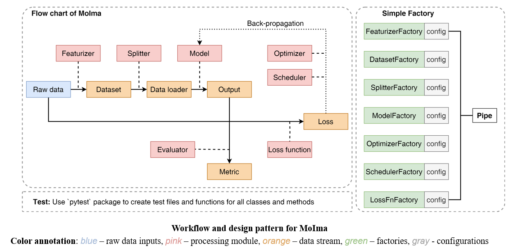

# <span style="color:#FF9EAA">Mo</span>lecule <span style="color:#FF9EAA">Ima</span>gination
This repository contains a framework for easily building, training, and evaluating machine learning models for molecular property prediction and molecule generation. The overview of the framework is shown below.


The main idea is to use *Simple Factory Pattern* to easily create featurizer, dataset, splitter, model, optimizer, scheduler, and loss function. Then the `Pipe` class will take care of the training, validation, and testing process. Coupled with `Pipe`, there is a `Config` class. All the configurations will be controled via a `Config` class, which could parse inputs from files, command line, or python arguments. Currently, the framework supports the following pipes:

- Regression / Classification: `DownstreamPipe`, available models include:
    - Multi-Layer Perceptron (MLP)
    - Graph Attention Networkv2 (GATv2) (https://arxiv.org/abs/2105.14491)
    - DimeNet and DimeNet++ (https://www.cs.cit.tum.de/daml/dimenet/)
    - FAENet (https://arxiv.org/abs/2305.05577)
- Molecule Generation: `VAEPipe` and `VaDEPipe`, available inputs include:
    - SMILES
    - SELFIES

The usage of the frameworks is simple, for example, to train a VAE model, you can simply run the following command:
```python
from moima.pipeline.vae_pipe import VAEPipe, VAEPipeConfig

# Specify the parameters for the VAEPipe
config = VAEPipeConfig(raw_path='./example/database/zinc1k.csv', 
                        desc='pytest_run', 
                        seq_len=120,
                        save_interval=50000,
                        log_interval=5,
                        vocab_size=100,
                        num_epochs=50)


pipe = VAEPipe(config)
pipe.train()
```

You can also easily evaluate the model or generate molecules using the following commands:
```python
pipe.eval()
sampled_smiles = pipe.sample(10)

# Save/Load the Pipe
pipe.save(name='test')
pipe.from_pretrained(path='test.pt')
```

The framework is still under development, and more features will be added in the future.

## Installation
First, install the required dependencies:
```bash
# Install torch and torch_geometric
conda install -y pytorch==2.3.0 torchvision==0.18.0 torchaudio==2.3.0 \
                 pytorch-cuda=11.8 -c pytorch -c nvidia
pip install torch_geometric
pip install torch_scatter torch_sparse -f https://data.pyg.org/whl/torch-2.3.0+cu118.html

# Install other dependencies
pip install e3nn egnn_pytorch mace_torch meeko numpy pandas pytest selfies
```

Then, clone the repository and install the package:
```bash
git clone https://github.com/fate1997/MoIma.git
cd MoIma
pip install -e .
```